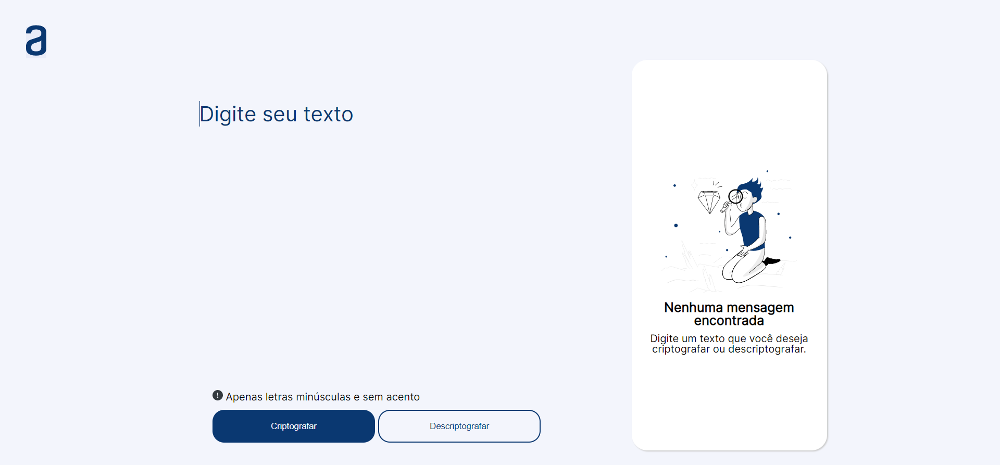

# Challenge ONE Sprint 01: Decodificador de textos

Este challenge faz parte do programa ONE - Oracle Next Education. 

## Decodificador

Neste projeto foi utilizado HTML, CSS e Javascript.

Confira o projeto clicando [aqui]() :point_left:

## Como funciona? 

Há duas opções possíveis, você pode optar por criptografar uma mensagem ou escolher descriptografá-la. Veja abaixo a tabela de conversão:

**Descriptografado**|a|e|i|o|u
:--|:--:|:--:|:--:|:--:|:--:
**Criptografado**|ai|enter|imes|ober|ufat

> A conversão está disponível apenas para letras minúsculas. Qualquer outro caractere não será alterado.

Além disso, há um botão de **Copiar**, que permite copiar o resultado da criptografia/descriptografia para a área de transerência. Com isso, basta usar o ***ctrl + V*** para colar o texto copiado.

